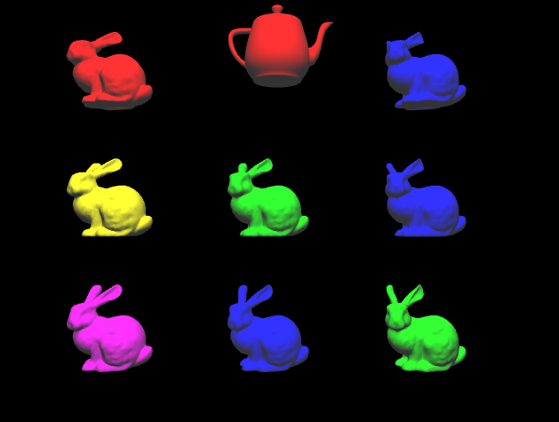
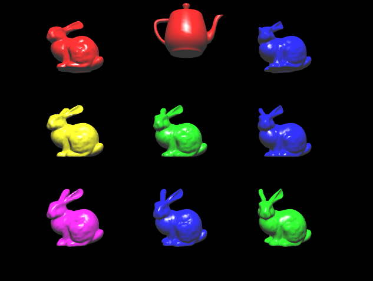
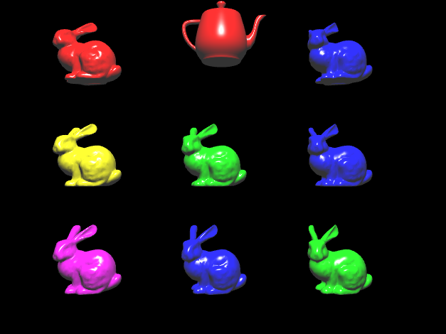
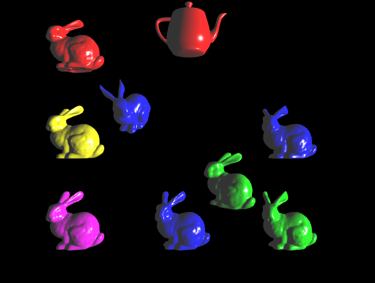

# Interactive 3D Graphics Application (WebGL)

This project is a two-part interactive 3D WebGL application created as part of a graphics programming lab.  
It demonstrates key concepts in 3D graphics including:

- Camera movement
- Object transformations (scaling, rotation, translation)
- User interaction (keyboard, mouse)
- Importing 3D models
- Shading and illumination models (Gouraud, Phong)

## Screenshots

Here are a few screenshots demonstrating the 3D scene and user interactions:

- **Gouraud/Diffuse**

- **Gouraud/Specular**

- **Phong/Specular**

- **Transformation of some objects + change of light position**

## Controls

This application supports camera, object, and lighting control. Here’s what you can do:

- **Mode Switching**  
  - `Space` — toggle between camera mode and object/light mode

- **Camera Movement** (in camera mode)  
  - `←` / `→` — move camera along the X axis  
  - `↑` / `↓` — move camera along the Y axis  
  - Click & drag — pan the scene (inverse camera translation)

- **Object/Light Selection**  
  - `1–9` — select one of the 9 objects  
  - `0` — select all objects (global transforms)  
  - `L` — when in object mode, toggle to light control

- **Scaling**  
  - `a` — decrease width 
  - `A` — increase width 
  - `b` — decrease height 
  - `B` — increase height 
  - `c` — decrease depth
  - `C` — increase depth

- **Rotation** (around local axes of the selected object or global axes when all are selected)  
  - `i` / `k` — rotate around X-axis (clockwise / counterclockwise)  
  - `o` / `u` — rotate around Y-axis (clockwise / counterclockwise)  
  - `l` / `j` — rotate around Z-axis (clockwise / counterclockwise)

- **Translation** (in object/light mode)  
  - `←` / `→` — move left / right (X axis)  
  - `↑` / `↓` — move up / down (Y axis)  
  - `,` / `.` — move forward / backward (Z axis)

- **Shading Model Toggle** 
  - `w` — Gouraud / Diffuse  
  - `e` — Gouraud / Specular  
  - `r` — Phong / Diffuse  
  - `t` — Phong / Specular

## Getting Started

To run this project you require:
- A modern browser with WebGL support (e.g., Chrome, Firefox)
- Local web server (e.g., Live Server extension in VSCode, `python -m http.server`, etc.)

### Run the Project

1. Clone the repository.
2. Serve the project using a local server. (e.g., use `python -m http.server` in cmd in the folder where 'index.html' is)
3. Open `localhost:8000` in your browser.

